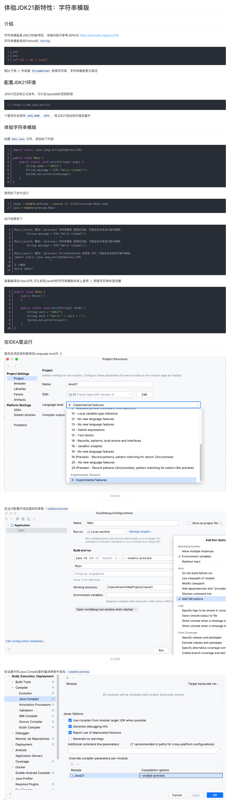

# jdk 安装配置

## JDK21 安装

- 下载 jdk([下载地址](https://www.oracle.com/java/technologies/downloads/))
- jdk 版本

  

- open -e ~/.bash_profile 和 open -e ~/.zshrc
- 添加如下内容

```bash
JAVA_HOME=/Library/Java/JavaVirtualMachines/jdk-21.0.4.jdk/Contents/Home
MAVEN_HOME=/Users/zhangyu/Documents/apache-maven-3.9.6
PATH=$JAVA_HOME/bin:$MAVEN_HOME/bin:$PATH
export JAVA_HOME
export MAVEN_HOME
export PATH
```

- source ~/.bash_profile

  source ~/.zshrc

## JDK21 新特性


